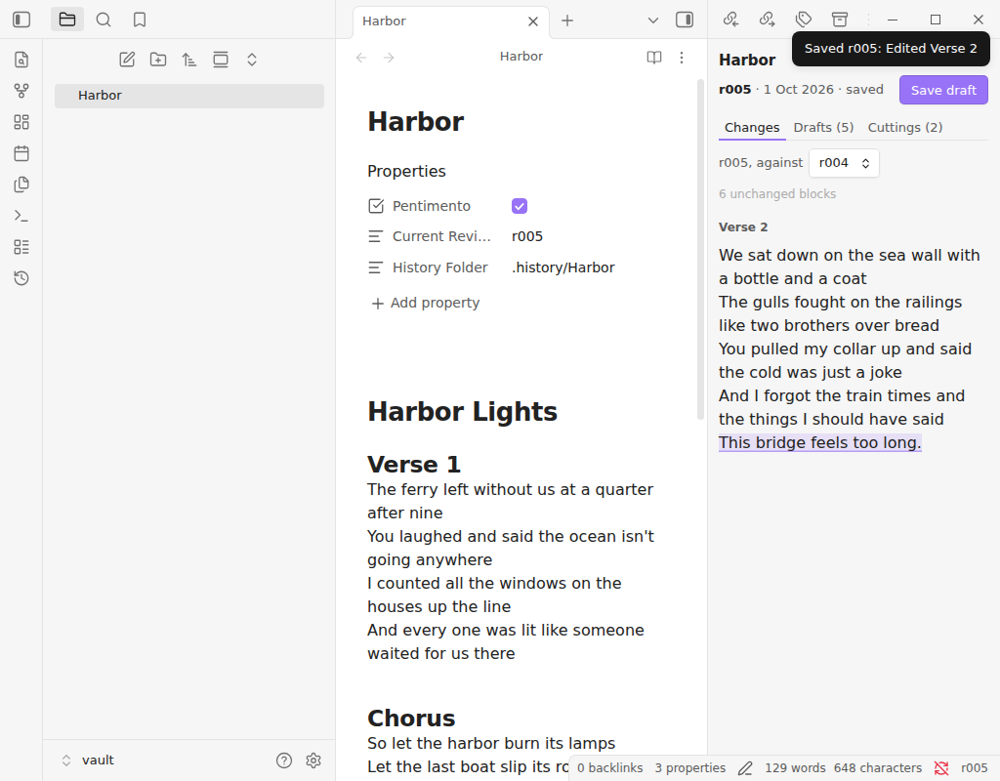
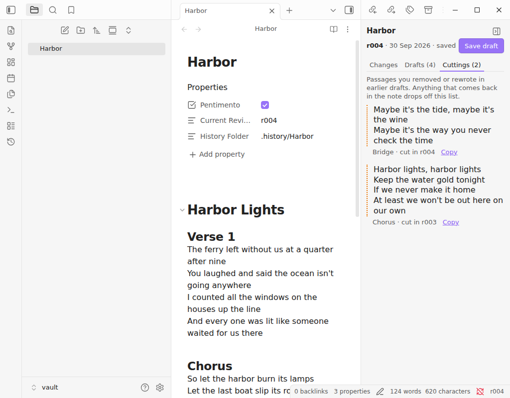

# Pentimento for Obsidian

Save drafts of a note without leaving Obsidian, and see what changed between them, what you cut, and any earlier draft you want back.

A pentimento is an earlier brushstroke showing through the paint on top of it. The plugin keeps your earlier drafts the same way: out of sight until you want them.



## Using it

- **Save draft** (the ribbon button, or the command palette) keeps a copy of the note as it is now. The summary is written for you from what changed, using your headings: "Rewrote Chorus", "Removed Bridge".
- **Save draft with a note…** lets you write the summary yourself, and why.
- The status bar shows the latest draft, and "· edited" once the note has moved since. Click it to show or hide the panel.
- **Show or hide drafts** (command palette, or the button at the top of the panel) opens the panel or collapses the right sidebar. You can give it a hotkey in Settings → Hotkeys.
- **The drafts panel** has three tabs:
  - *Changes*: the note now against any earlier draft. Removed words are struck through and new ones marked; verse and lists compare line by line.
  - *Drafts*: every draft with its summary, date, and word count. "What changed" shows that draft's own changes. "Restore" brings it back as a new draft, after saving the note's current text, so nothing is lost.
  - *Cuttings*: passages you removed or rewrote completely in earlier drafts, with a Copy button. A passage that comes back in the note drops off the list.
- **Remove drafts from this note…** deletes the note's drafts and its three Pentimento properties, after asking. The note's text stays as it is.



## Where drafts live

Each draft is a copy of the note in a hidden `.history/<note>/` folder beside it, with a summary of each draft in `meta.yml`. Everything is plain text: it syncs with the rest of your vault and can be read without the plugin.

The first draft adds three properties to the note: `Pentimento`, `Current Revision`, and `History Folder`. Saving a draft edits only those three lines, so your own properties stay exactly as you wrote them.

The plugin reads and writes the `.history` folders through Obsidian's file adapter, because Obsidian's vault index leaves out hidden folders. It never touches files outside a note's own history folder, the note itself, and its own settings.

Drafts use the same format as the [Pentimento command-line tool](https://github.com/lucastraba/pentimento), so you can use either, or both, on the same notes.

## Settings

- **Your name** is recorded on each draft.
- **Save a draft every day** (off by default): once a day, notes that already have drafts and changed since their last one get a new draft. A note you've edited in the last 15 minutes waits until you stop.

## Installing

Until the plugin is in Obsidian's community list, download `main.js`, `manifest.json`, and `styles.css` from the [latest release](https://github.com/lucastraba/pentimento-obsidian/releases/latest) into `<your vault>/.obsidian/plugins/pentimento/`, then turn Pentimento on in Settings → Community plugins.

From source:

```bash
npm ci
npm run build
npm run install-vault -- "/path/to/your vault"
```

## Development

- `npm run dev` rebuilds on change.
- `npm test` builds the plugin and runs `test/harness.mjs`, which loads the built `main.js` against a small fake of Obsidian's API and walks a note through saving, editing, restoring, daily drafts, and removal.
- `npm run lint` applies Obsidian's own review rules ([eslint-plugin-obsidianmd](https://github.com/obsidianmd/eslint-plugin)).
- The build fails if anything in the bundle needs Node, which Obsidian on phones doesn't have.

The draft format (saving, reading, restoring, the diff, cuttings) comes from the `pentimento` npm package, where it is tested against the command-line tool's own output.

To release, bump the version in `manifest.json`, `package.json`, and `versions.json`, add a `CHANGELOG.md` entry, and push a tag with the bare version (`0.3.1`). CI builds the plugin and publishes the GitHub release Obsidian installs from.
